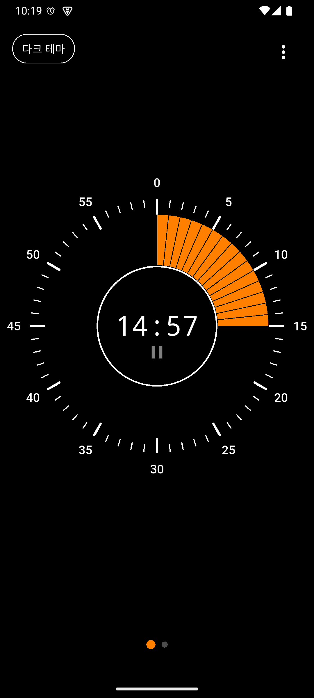
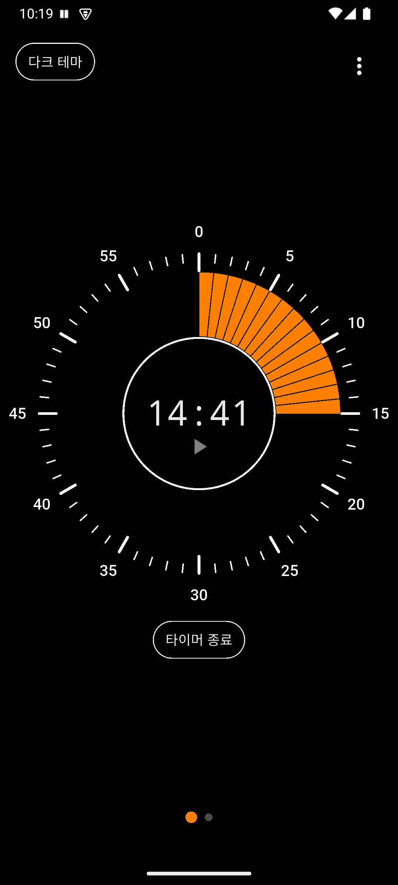
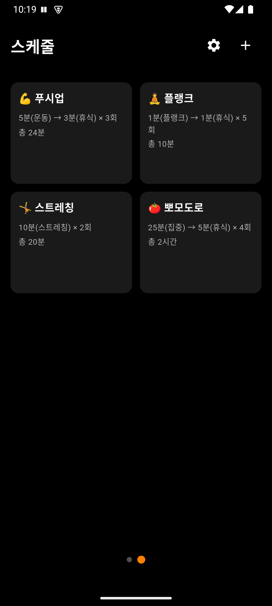
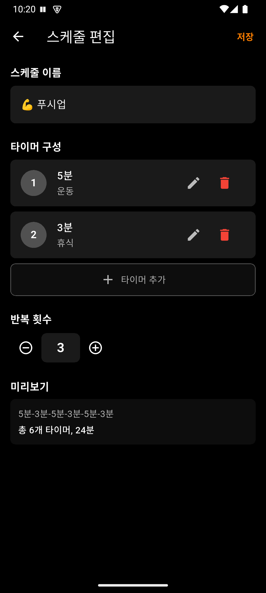
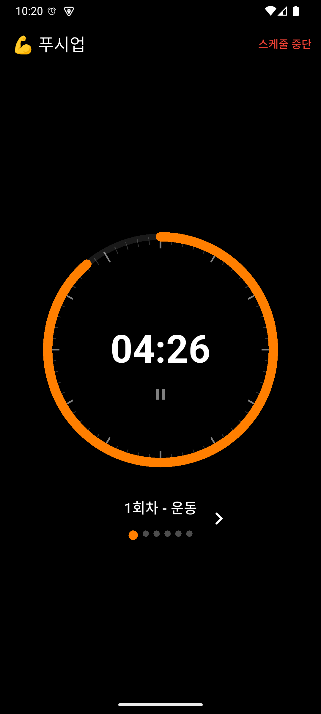
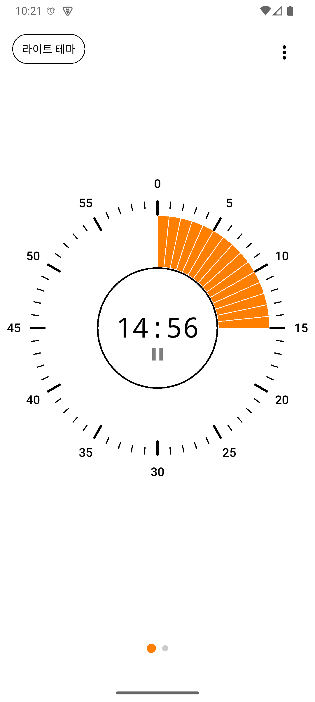

# TamTam User Guide

**English** | [한국어](../../ko/tamtam/guide.md)

[Back to Home](../index.md)

---

Set a timer easily by dragging the circular dial and create schedules to run multiple timers automatically in sequence. **TamTam** helps you manage your time.

---

## Table of Contents

1. [What is TamTam?](#what-is-tamtam)
2. [Key Features](#key-features)
3. [How to Use](#how-to-use)
4. [FAQ](#faq)

---

## What is TamTam?

TamTam is an intuitive countdown timer app with a circular drag interface.

**Key Highlights:**
- Set timers from 0 to 60 minutes by dragging the circular dial
- Schedule feature to combine multiple timers
- Accurate alarms even in the background
- Dark/Light theme support
- Portrait and landscape mode support

*Main timer screen — The circular dial gauge shows remaining time with a countdown displayed in the center*

---

## Key Features

### 1. Circular Drag Timer

Drag the circular dial in the center of the screen to set the timer duration. You can set a time from 0 to 60 minutes, with haptic feedback each time the minute changes.

After setting the timer, tap the **Start** button at the bottom to begin the countdown.

*Timer running — The orange gauge indicates remaining time, with a pause icon displayed below the time*

### 2. Pause / Resume

Tap the time display area during a running timer to **pause** it. While paused, the time blinks, and tapping again resumes the timer.

A **Stop** button appears while paused, allowing you to cancel the timer.

*Paused state — A play icon is shown, and the "Stop Timer" button appears at the bottom*

### 3. Schedule Feature

Combine multiple timers into a single schedule and run them consecutively. Use it for workouts, studying, cooking, and more.

**Schedule Components:**
- **Schedule Name**: A title to identify the purpose
- **Timer Items**: Individual timers with time and label (multiple can be added)
- **Repeat Count**: How many times to repeat the entire schedule

**Built-in Schedules:**
- Push-ups (Exercise 5 min + Rest 3 min, 3 repeats)
- Plank (Plank 1 min + Rest 1 min, 5 repeats)
- Stretching (Stretching 10 min, 2 repeats)
- Pomodoro (Focus 25 min + Break 5 min, 4 repeats)

*Schedule list — Built-in schedules displayed as cards, with the + button at the top right to add new schedules*

*Schedule edit — Set the schedule name, timer items (time/label), repeat count, and check the preview at the bottom*

### 4. Schedule Execution

When a schedule runs, the configured timers execute automatically in sequence. Each timer displays a different colored gauge, making it easy to track progress at a glance.

**Controls During Execution:**
- **Previous/Next buttons**: Skip to the previous or next timer
- **Progress indicator**: Dots at the top of the screen show current position
- **Pause**: Tap the time area to pause/resume

*Schedule execution — The current timer's label and round are displayed, with dot indicators at the bottom showing overall progress*

### 5. Background Timer

The timer works accurately even when you close the app or switch to another app.

- **Android**: Reliable background execution via Foreground Service
- **iOS**: Check remaining time on the lock screen and Dynamic Island (Live Activity)

### 6. Alarm (System-Linked)

When the timer completes, the notification method is automatically determined by your device's ringer mode.

- **Normal mode**: Sound + Vibration
- **Vibration mode**: Vibration only
- **Silent mode**: No notification

No separate settings needed — it follows your device's current mode.

### 7. Dark/Light Theme

Tap the theme button at the top left of the screen to switch between dark mode and light mode.

 

*Left: Dark theme / Right: Light theme*

### 8. Landscape Mode Support

Both portrait and landscape modes are supported. The layout automatically adjusts when you rotate your device. Optimized display is also provided for foldable devices.

---

## How to Use

### Screen Layout

TamTam consists of **2 pages**. Swipe left or right to switch between pages, or tap the page indicator at the bottom.

- **Page 1**: Main Timer — Quickly set and start a timer with the circular dial
- **Page 2**: Schedule List — Manage and run your saved schedules

### Step 1: Install the App

Search for **TamTam** on Google Play Store or Apple App Store and install it.

### Step 2: Using a Single Timer

1. On Page 1 (Main Timer), drag the circular dial to set the time
2. Tap the **Start** button at the bottom
3. An alarm will sound when the timer completes

### Step 3: Using Schedules

1. Swipe right to go to Page 2 (Schedule List)
2. Tap a built-in schedule or tap the **+** button to create a new one
3. On the schedule edit screen, set the name, timer items, and repeat count
4. After saving, tap the schedule card to start execution

### Step 4: Settings Menu

From the menu button at the top right, you can access:

- App version
- User guide
- Terms of Service
- Privacy Policy
- Open source licenses

---

## FAQ

### Q1: Does the timer work if I close the app?

**A:** Yes, the timer works accurately in the background. On Android, it uses a Foreground Service, and on iOS, it uses a native timer.

### Q2: Does the alarm work in silent mode?

**A:** When your device is in silent mode, neither alarm sound nor vibration will occur. In vibration mode, only vibration occurs. In normal mode, both sound and vibration occur.

### Q3: Can I create my own schedules?

**A:** Yes, tap the **+** button on the schedule list screen to create a new schedule. You can add multiple timer items and set repeat counts.

### Q4: Can I delete the built-in schedules?

**A:** Yes, you can freely delete the built-in schedules. Deleted schedules will not be automatically re-added.

### Q5: Can I skip a specific timer during schedule execution?

**A:** Yes, use the previous/next buttons on the schedule execution screen to jump to the desired timer.

### Q6: Can I check the timer on the iOS lock screen?

**A:** Yes, on iOS 16.2 and above, you can check the remaining time on the lock screen and Dynamic Island via Live Activity.

---

## Contact

If you have any questions, please contact us at puppytigerstudio@gmail.com.
