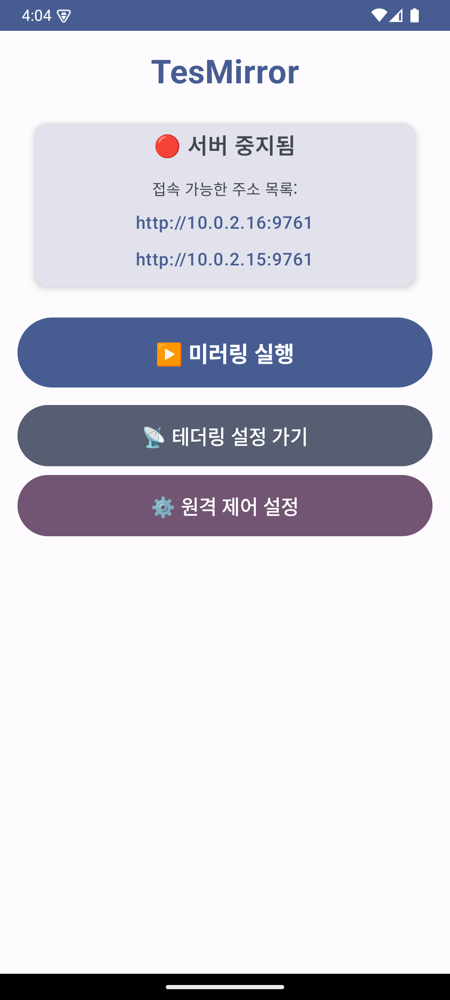
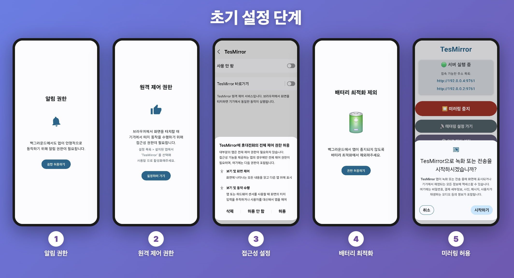
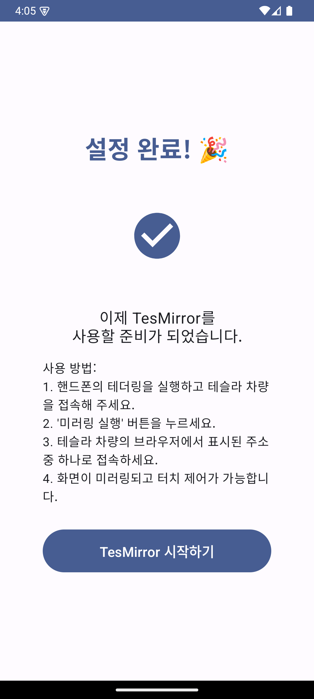
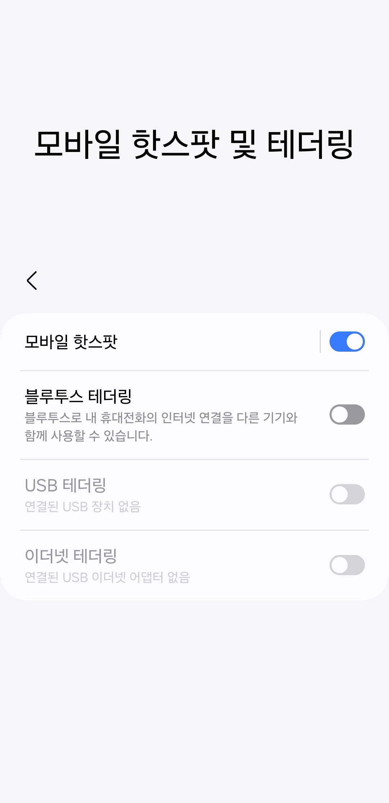
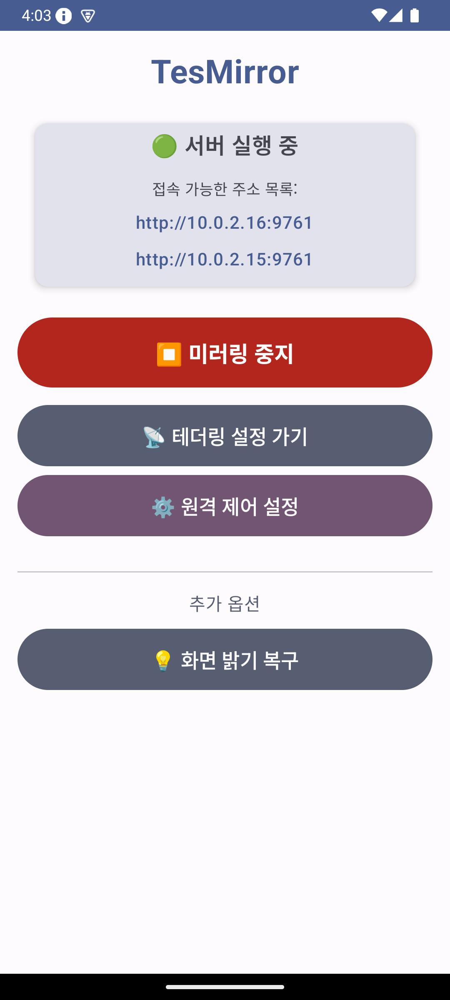
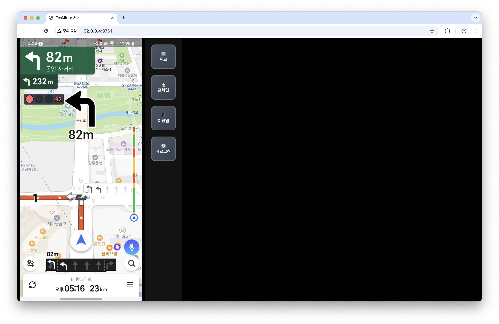
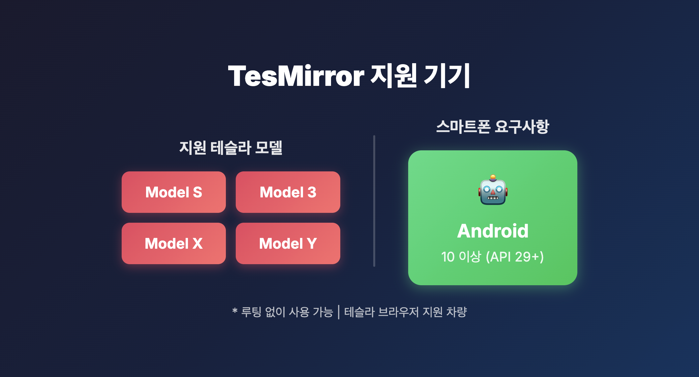

# TesMirror User Guide

**English** | [한국어](../../ko/tesmirror/guide.md)

[Back to Home](../index.md)

---

Have you ever wanted to view your smartphone screen on Tesla's large display? With **TesMirror**, you can mirror your Android phone screen to Tesla's browser and control your phone directly from Tesla's touchscreen.

---

## Table of Contents

1. [What is TesMirror?](#what-is-tesmirror)
2. [Requirements](#requirements)
3. [Initial Setup](#initial-setup)
4. [How to Use (4 Steps)](#how-to-use-4-steps)
5. [Key Features](#key-features)
6. [Supported Devices](#supported-devices)
7. [FAQ](#faq)

---

## What is TesMirror?

TesMirror is an app that mirrors your Android smartphone screen to Tesla's browser in real-time.

**Key Features:**
- No rooting required
- Control your phone via Tesla's touchscreen
- Simple one-touch mirroring
- Initial setup takes about 3 minutes

*TesMirror app main screen - Start mirroring button and tethering settings shortcut*

---

## Requirements

Before starting mirroring, please check the following:

- **Smartphone**: Android 10 or higher
- **Tesla Vehicle**: Model S, Model 3, Model X, Model Y
- **Network**: Phone's hotspot (tethering) function

> **Important:** Your Tesla must be connected to your smartphone's hotspot.

---

## Initial Setup

A simple initial setup is required when using TesMirror for the first time. It takes about 3 minutes to complete.

### Step 1: Install the App

Search for **TesMirror** on Google Play Store and install it.

### Step 2: Grant Permissions

Please allow the permissions requested when launching the app:
- Screen recording permission (for mirroring)
- Accessibility service permission (for touch control)
- Notification permission
- Battery optimization exclusion (for uninterrupted mirroring in background)

*5-step initial setup: Notification permission → Remote control permission → Accessibility settings → Battery optimization exclusion → Mirroring permission*

### Step 3: Setup Complete

Once all permissions are granted, setup is complete.

*Setup complete screen - Brief usage instructions are displayed*

---

## How to Use (4 Steps)

Once initial setup is complete, you can start mirroring in 4 steps.

### Step 1: Connect Tethering

1. Turn on your smartphone's **hotspot (tethering)**
2. Connect to your smartphone's hotspot in Tesla's Wi-Fi settings

*Turn on hotspot and connect Tesla*

> **Tip:** Tap the "Go to Tethering Settings" button in the app to go directly to hotspot settings.

---

### Step 2: Start Mirroring

Open the TesMirror app and tap the **Start Mirroring** button.

*Tap the "Start Mirroring" button in the app*

When you press the button, the mirroring server starts and the connection address is displayed on screen.

---

### Step 3: Enter Address in Tesla Browser

1. Open the **browser** on Tesla's screen
2. Enter the address shown in the app (e.g., `http://10.0.2.16:9761`)
3. Tap the **Go** button

*Server running - Enter the displayed address in Tesla's browser*

---

### Step 4: Start Mirroring!

Once connected, your smartphone screen will be displayed on Tesla's large screen.

*Smartphone screen mirrored on Tesla browser*

Now you can control your smartphone by touching Tesla's screen!

---

## Key Features

### 1. One-Touch Mirroring

Start mirroring easily with just one button.

### 2. Touch Control

Control your smartphone directly from Tesla's touchscreen.

**Supported touch gestures:**
- **Tap**: Screen touch
- **Swipe**: Scroll up/down/left/right
- **Pinch Zoom**: Zoom in/out with two fingers

### 3. Large Screen Navigation

View navigation apps bigger and clearer on Tesla's 15-17 inch large screen.

---

## Supported Devices

### Supported Tesla Models

- Model S: O
- Model 3: O
- Model X: O
- Model Y: O

### Smartphone Requirements

- **Operating System**: Android 10 or higher
- **Recommended**: Best performance on Android 12 or higher

---

## FAQ

### Q1: What should I do if I can't connect?

**A:** Please check the following:
1. Make sure Tesla is connected to your smartphone's hotspot
2. Make sure the hotspot is activated
3. Restart the app and try again

### Q2: What if the screen is choppy or slow?

**A:** The hotspot signal may be weak:
1. Place your smartphone close to Tesla's screen
2. Disconnect other devices from the hotspot

### Q3: Touch is not working

**A:** Make sure accessibility service permission is enabled:
1. Phone Settings > Accessibility
2. Find TesMirror
3. Enable the service

### Q4: Does it consume a lot of battery?

**A:** Battery usage increases due to the nature of screen mirroring. We recommend connecting to the vehicle charger for extended use.

### Q5: Is rooting required?

**A:** No, TesMirror can be used **without rooting**.

---

## Conclusion

Make the most of Tesla's large screen with TesMirror! Enjoy navigation, videos, games, and various apps on a bigger and more convenient display.

---

## Contact

For inquiries, please contact puppytigerstudio@gmail.com.
