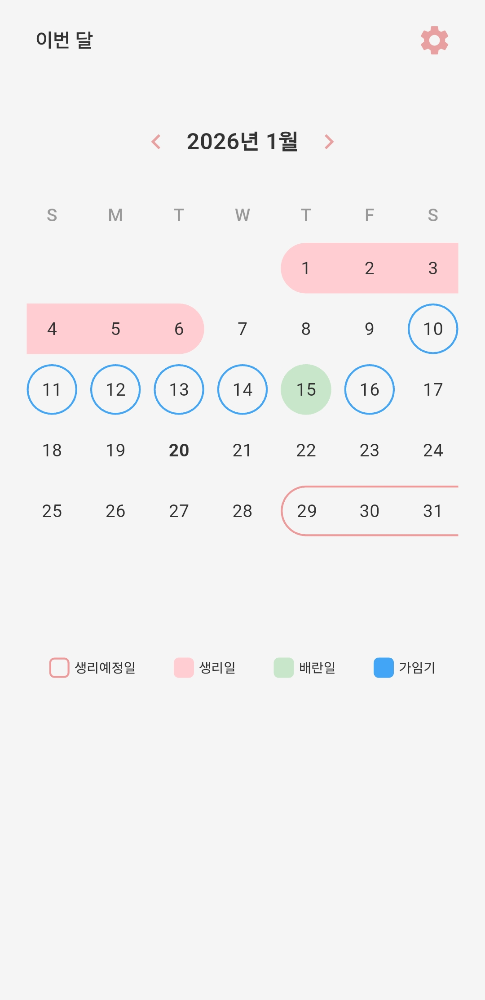
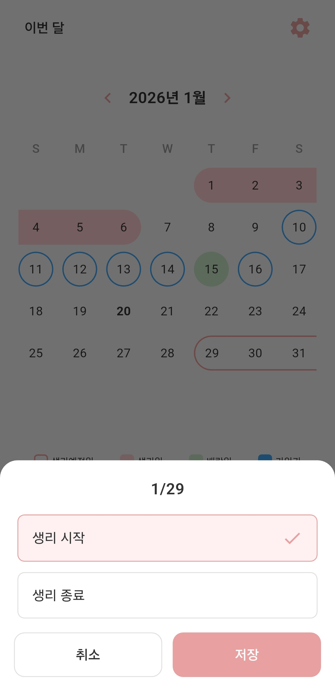
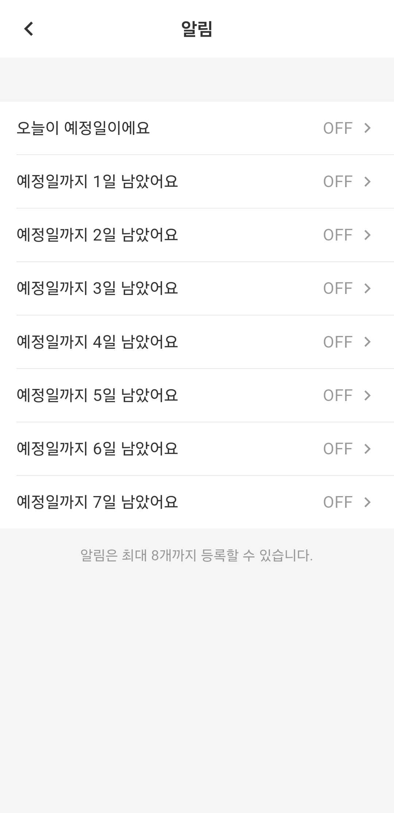
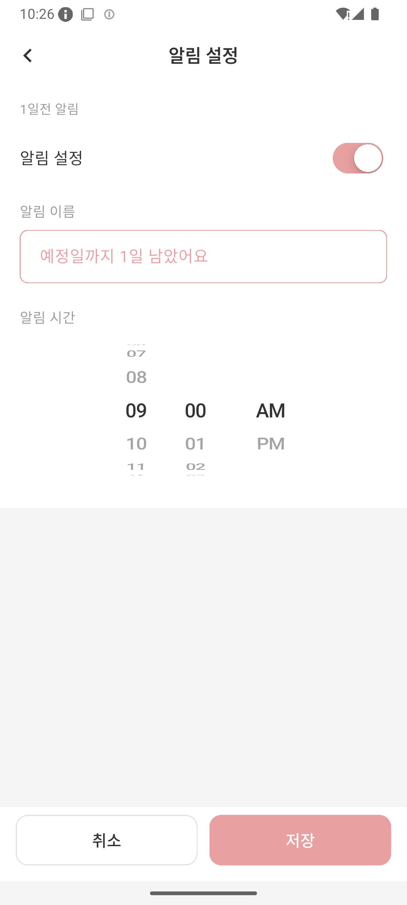
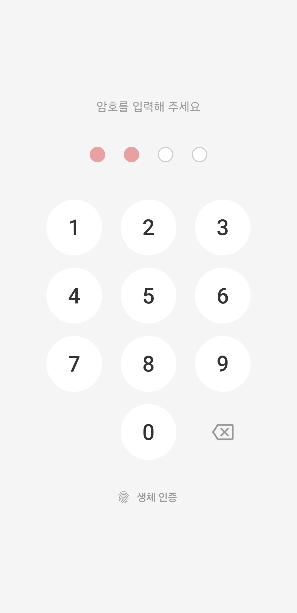
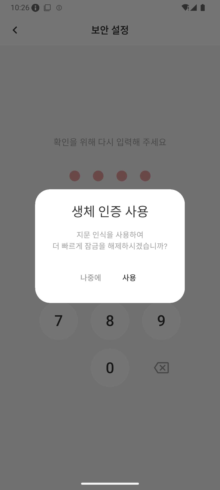
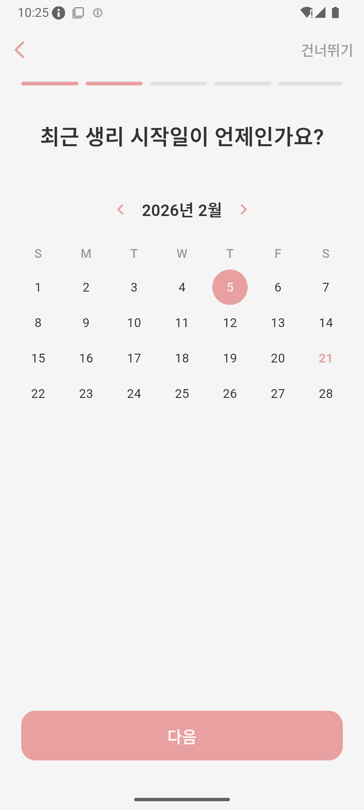
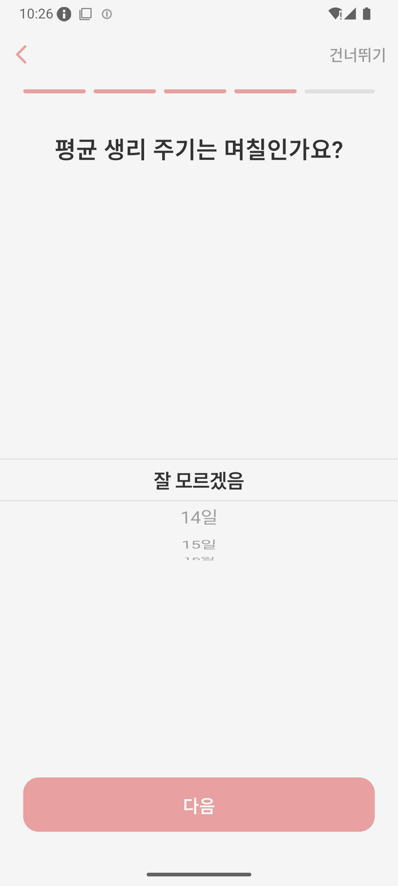
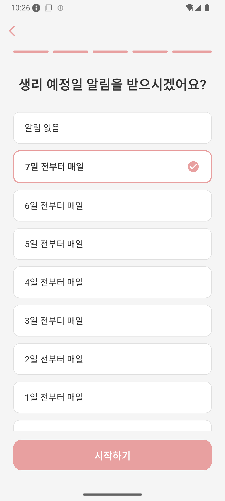
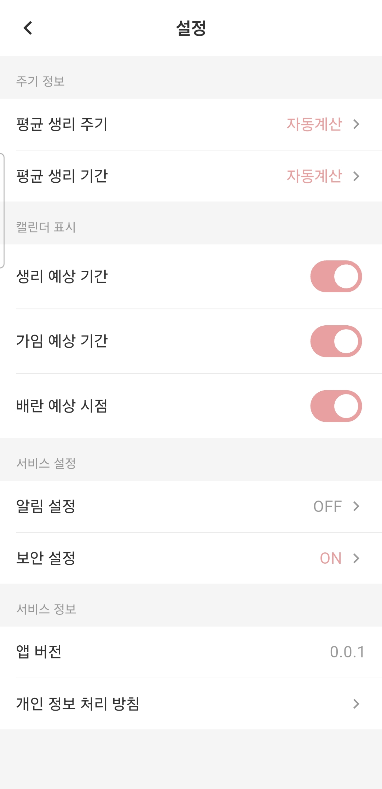

# Phase 사용 가이드

**한국어** | [English](../../en/phase/guide.md)

[홈으로 돌아가기](../index.md)

---

월경주기를 간편하게 기록하고, 예상 생리일, 가임기, 배란일을 확인하세요. **Phase**가 당신의 건강한 일상을 도와드립니다.

---

## 목차

1. [Phase란?](#phase란)
2. [주요 기능](#주요-기능)
3. [사용 방법](#사용-방법)
4. [설정](#설정)
5. [자주 묻는 질문 (FAQ)](#자주-묻는-질문-faq)

---

## Phase란?

Phase는 월경주기를 기록하고 관리할 수 있는 앱입니다. 기록이 쌓일수록 예측이 정확해지며, 모든 데이터는 기기 내부에만 저장되어 안전합니다.

**주요 특징:**
- 간편한 생리 시작일/종료일 기록
- 예상 생리일, 가임기, 배란일 자동 예측
- 직관적인 캘린더 뷰와 색상별 구분
- 생리 예정일 알림 (당일~7일 전, 최대 8개)
- PIN 암호 및 생체 인증(지문/Face ID) 잠금
- 다크/라이트 테마 자동 지원 (시스템 설정 연동)

*홈 화면 — 캘린더에서 생리일, 생리예정일, 배란일, 가임기를 한눈에 확인할 수 있습니다*

---

## 주요 기능

### 1. 월경주기 캘린더

홈 화면의 캘린더에서 월경주기 정보를 한눈에 확인할 수 있습니다. 좌우 스와이프로 월을 이동하며, 좌측 상단의 **"이번 달"** 버튼을 탭하면 현재 월로 빠르게 돌아옵니다.

**캘린더 색상 안내:**
- **핑크색 배경** — 생리일 (실제 기록된 생리 기간)
- **핑크색 테두리** — 생리예정일 (다음 생리 예상 기간)
- **연초록색 배경** — 배란일 (배란 예상 시점)
- **파란색 테두리** — 가임기 (가임 예상 기간)

캘린더 하단의 범례에서 각 색상의 의미를 확인할 수 있습니다.

### 2. 생리 기록

캘린더에서 날짜를 탭하면 생리 입력 화면이 나타납니다. **생리 시작** 또는 **생리 종료**를 선택하고 **저장** 버튼을 눌러 기록합니다.

*생리 입력 — 날짜를 탭하면 생리 시작/종료를 선택하는 바텀시트가 나타납니다*

**기록 방법:**
- **생리 시작**: 생리가 시작된 날짜를 탭 → "생리 시작" 선택 → 저장
- **생리 종료**: 생리가 끝난 날짜를 탭 → "생리 종료" 선택 → 저장
- **기간 초기화**: 기존 기록이 있는 날짜에서 "기간 초기화"를 탭하면 해당 기록을 삭제할 수 있습니다

### 3. 주기 예측

기록된 데이터를 바탕으로 다음 생리 예정일을 자동으로 예측합니다. 최소 2개 이상의 기록이 있으면 평균 주기를 계산하여 더 정확한 예측을 제공합니다.

**예측 항목:**
- **다음 생리 예정일**: 가장 최근 시작일 + 평균 주기
- **배란 예상일**: 다음 생리 예정일 - 14일
- **가임기**: 배란 예상일 전후 기간 (배란일 5일 전 ~ 1일 후)

예측은 최대 12개월 후까지 캘린더에 표시됩니다.

### 4. 생리 기간 자동 입력

설정에서 **평균 생리 기간**을 지정하면, 생리 시작일만 입력해도 종료일이 자동으로 설정됩니다. 매번 종료일을 따로 기록할 필요가 없어 편리합니다.

### 5. 알림 기능

생리 예정일 전에 미리 알림을 받을 수 있습니다. 당일부터 최대 7일 전까지, 총 8개의 알림을 개별적으로 설정할 수 있습니다.

*알림 설정 — 당일부터 7일 전까지 최대 8개의 알림을 개별적으로 설정할 수 있습니다*

**알림 설정 항목:**
- 오늘이 예정일이에요 (당일)
- 예정일까지 1일~7일 남았어요

각 알림은 개별적으로 ON/OFF할 수 있으며, 알림 이름과 시간도 원하는 대로 변경할 수 있습니다.

*알림 설정 상세 — 개별 알림의 ON/OFF, 알림 이름, 알림 시간을 설정할 수 있습니다*

### 6. 보안 잠금

개인 정보 보호를 위해 앱 잠금 기능을 제공합니다.

*잠금 화면 — 4자리 PIN 암호 또는 생체 인증으로 앱을 보호합니다*

**보안 기능:**
- **PIN 암호**: 4자리 숫자 암호 설정
- **생체 인증**: 지문 인식 또는 Face ID로 빠르게 잠금 해제
- 앱 실행 시 잠금 화면이 표시되며, 생체 인증이 우선 시도됩니다

*보안 설정 — PIN 설정 완료 후 생체 인증 사용 여부를 선택할 수 있습니다*

---

## 사용 방법

### Step 1: 앱 설치

Google Play 스토어 또는 Apple App Store에서 **Phase**를 검색하여 설치합니다.

### Step 2: 이용약관 동의

앱 최초 실행 시 이용약관 및 개인정보처리방침 동의 화면이 표시됩니다. 각 약관을 탭하면 내용을 확인할 수 있으며, 동의 후 시작합니다.

### Step 3: 초기 설정 (온보딩)

앱이 단계별로 초기 정보를 안내합니다.

1. **권한 요청** (Android): 알림 권한과 배터리 최적화 제외를 허용하면 알림이 정확하게 동작합니다
2. **최근 생리 시작일**: 캘린더에서 가장 최근 생리가 시작된 날짜를 선택합니다
3. **생리 종료일**: 생리가 끝난 날짜를 선택합니다
4. **평균 생리 주기**: 휠 피커로 평균 주기를 선택합니다 (모르면 "잘 모르겠음" 선택, 자동 계산됨)
5. **알림 설정**: 생리 예정일 알림을 받을 시점을 선택합니다

  

*좌: 최근 생리 시작일 선택 / 중: 평균 생리 주기 설정 / 우: 알림 설정*

### Step 4: 생리 기록하기

1. 홈 화면 캘린더에서 생리가 시작된 날짜를 탭합니다
2. 바텀시트에서 **"생리 시작"**을 선택합니다
3. **저장** 버튼을 탭합니다
4. 생리가 끝나면 마찬가지로 종료일을 기록합니다

### Step 5: 예측 확인

홈 화면 캘린더에서 다음 생리 예정일, 가임기, 배란일을 색상으로 구분하여 확인합니다. 캘린더를 좌우로 스와이프하면 이전/다음 달의 예측도 확인할 수 있습니다.

---

## 설정

우측 상단의 톱니바퀴 아이콘을 탭하면 설정 화면으로 이동합니다.

*설정 화면 — 주기 정보, 캘린더 표시, 서비스 설정을 관리합니다*

### 주기 정보

- **평균 생리 주기**: "자동계산" 또는 14~60일 수동 설정. 자동계산은 기록된 데이터를 기반으로 평균 주기를 자동 산출합니다
- **평균 생리 기간**: "사용안함" 또는 1~14일 수동 설정. 설정 시 시작일 입력만으로 종료일이 자동 입력됩니다

### 캘린더 표시

- **생리 예상 기간**: 미래 예측 생리예정일 표시 ON/OFF
- **가임 예상 기간**: 가임기 표시 ON/OFF
- **배란 예상 시점**: 배란일 표시 ON/OFF

### 서비스 설정

- **알림 설정**: 생리 예정일 알림 관리 화면으로 이동
- **보안 설정**: PIN 암호 및 생체 인증 설정 화면으로 이동

### 서비스 정보

- **앱 버전**: 현재 설치된 앱 버전
- **오픈소스 라이선스**: 사용된 오픈소스 라이선스 목록
- **사용 가이드**: 이 가이드 페이지
- **이용약관**: 서비스 이용약관
- **개인 정보 처리 방침**: 개인정보처리방침

---

## 자주 묻는 질문 (FAQ)

### Q1: 데이터는 어디에 저장되나요?

**A:** 모든 데이터는 기기 내부에만 저장됩니다. 외부 서버로 전송되지 않으므로 안심하고 사용하세요.

### Q2: 주기가 불규칙해도 사용할 수 있나요?

**A:** 네, 기록을 쌓을수록 예측 정확도가 높아집니다. 최소 2개 이상의 기록이 있으면 평균 주기를 자동으로 계산합니다. 주기를 직접 지정하고 싶다면 설정에서 수동으로 입력할 수도 있습니다.

### Q3: 알림은 어떻게 설정하나요?

**A:** 설정 > 알림 설정에서 당일부터 7일 전까지 최대 8개의 알림을 개별적으로 ON/OFF할 수 있습니다. 각 알림의 이름과 시간도 변경할 수 있습니다.

### Q4: 보안 잠금은 어떻게 설정하나요?

**A:** 설정 > 보안 설정에서 4자리 PIN 암호를 설정합니다. PIN 설정 후 기기에서 생체 인증을 지원하면 지문 또는 Face ID 사용 여부를 선택할 수 있습니다.

### Q5: 암호를 잊어버리면 어떻게 하나요?

**A:** 보안상 암호 복구 기능은 제공되지 않습니다. 암호를 잊으신 경우 앱을 삭제 후 다시 설치해야 합니다. 이 경우 기존 데이터는 모두 초기화됩니다.

### Q6: 생리 기간 자동 입력은 어떻게 사용하나요?

**A:** 설정 > 평균 생리 기간에서 원하는 일수를 설정하면, 이후 생리 시작일만 기록해도 종료일이 자동으로 입력됩니다.

### Q7: 캘린더에서 배란일이나 가임기를 숨길 수 있나요?

**A:** 네, 설정 > 캘린더 표시에서 생리 예상 기간, 가임 예상 기간, 배란 예상 시점을 각각 ON/OFF할 수 있습니다.

### Q8: 잘못 기록한 생리 날짜를 수정하려면?

**A:** 캘린더에서 기록된 날짜를 탭한 뒤 "기간 초기화"를 선택하면 해당 기록이 삭제됩니다. 이후 올바른 날짜에 다시 기록하시면 됩니다.

---

## 문의

문의사항이 있으시면 puppytigerstudio@gmail.com으로 연락해주세요.
